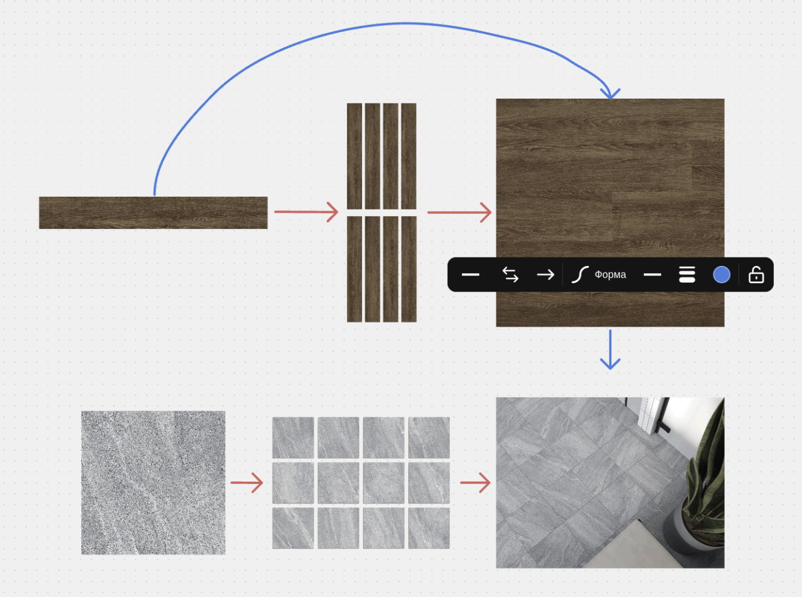
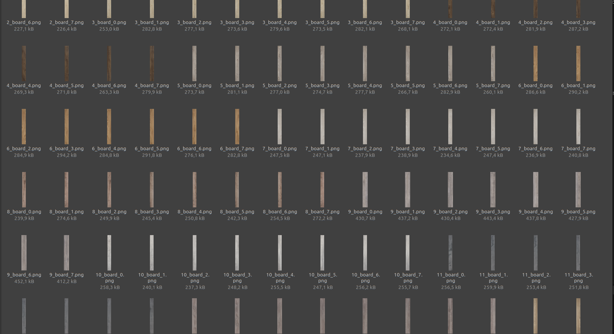
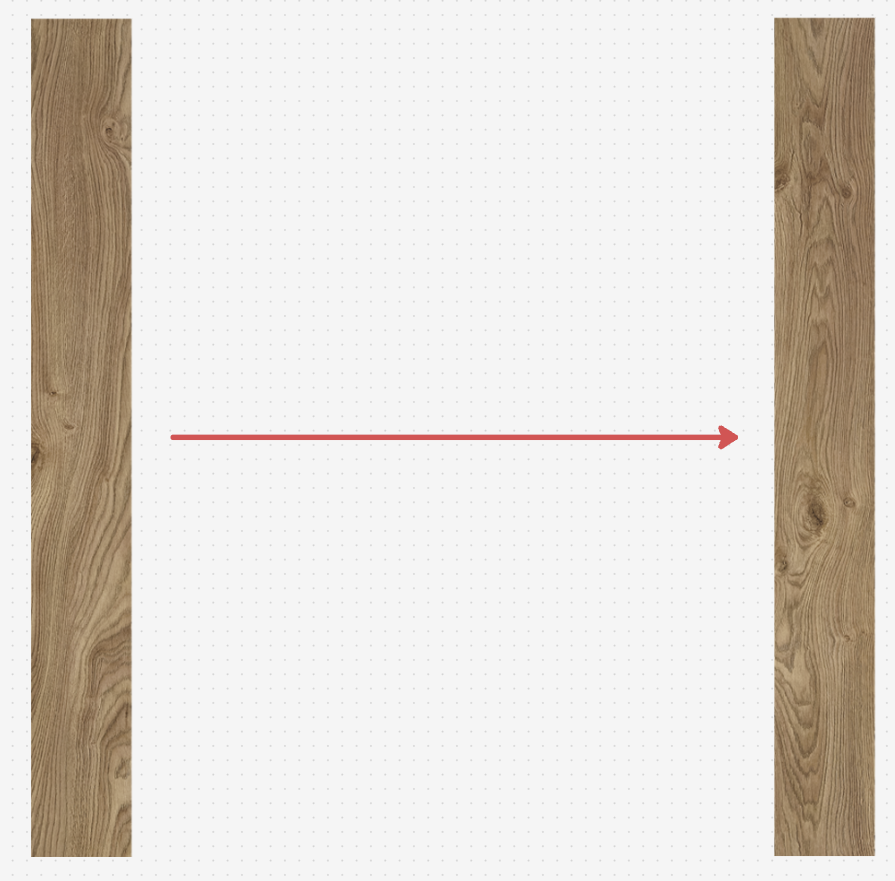
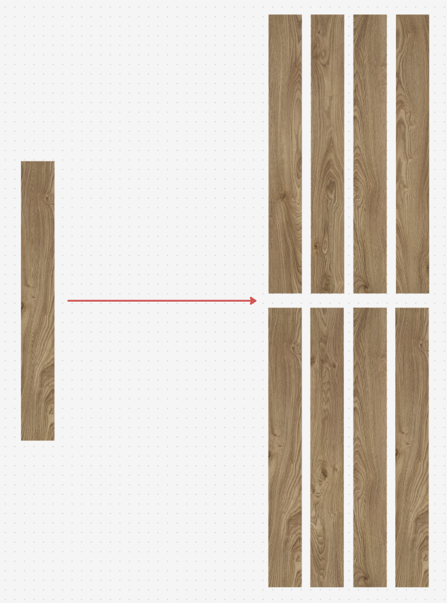

# Floor coverings

## Project Description

Our project is an AI-driven solution designed to generate realistic and visually coherent parquet floor patterns using Img2Img techniques. The goal of this project is to create customizable floor textures that seamlessly extend from an original sample, maintaining stylistic consistency while allowing for various customizations such as grain, grout color, chamfer, and mounting type.

The generated patterns could be used for both small-scale and large-scale flooring applications, with options for post-processing techniques like super-resolution to enhance the final output quality.

## [Dataset](https://drive.google.com/drive/u/2/folders/1ZQPvnsD83WCaFw7JWHrhILwrFOtJ1Xrh)

## Project Plan

1. **Dataset Preparation** - Done:
   - Collected high-quality parquet images.
   - Preprocess the images to divide it into desks.
   
   

2. **Model Selection and Fine-Tuning** - Done:
   - We experimented with different VAE (taking another distribution in the latent space) and SDXL. Their pretrained versions showed not ideal situtaion.
   - Both of them has their pros and cons. VAE is fast but encoder tries to reproduce original image, so we need to retrain the VAE to generate different patterns. SDXL is slow and can generate different pattern, but it nead finetuning. 

3. **Pattern Generation Method** - Done:
   - **Method 1**: Generate and assemble similar parquet patterns.
   
   

   - **Method 2**: Generate several parquet simultaneously.
   
   

   - First method will be used with VAE, because it's fast and can generate 
   - Second method will be used with SDXL, because it's more time consuming.

4. **Model Fine-Tuning** - In progress:
   - We collected dataset for finetuning models.
   - Now we need to retrain VAE, and if results will be bad, finetune sdxl.

5. **Customization**: - In progress:
   - Write a code that will combine several parquets to a puzzle (mash).
   - Add parameters for grain, grout color or type, chamfer, and mounting type.
   - Allow users to customize the generated mash according to their preferences.

5. **Post-Processing**: - In plan:
   - Apply refinement techniques like super-resolution to enhance the final output quality.