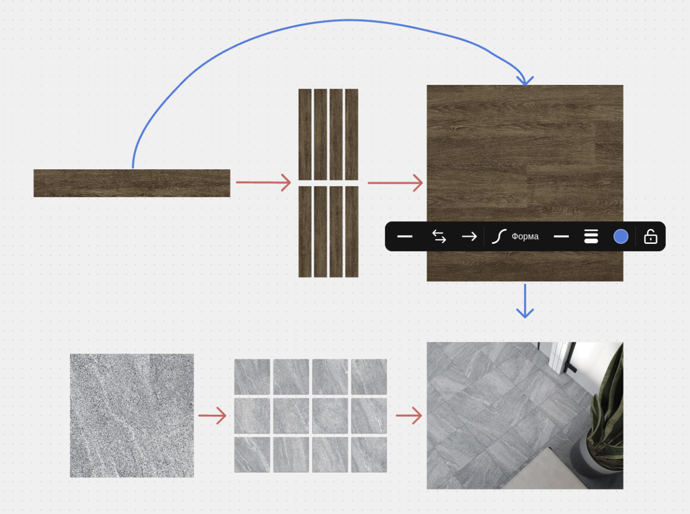
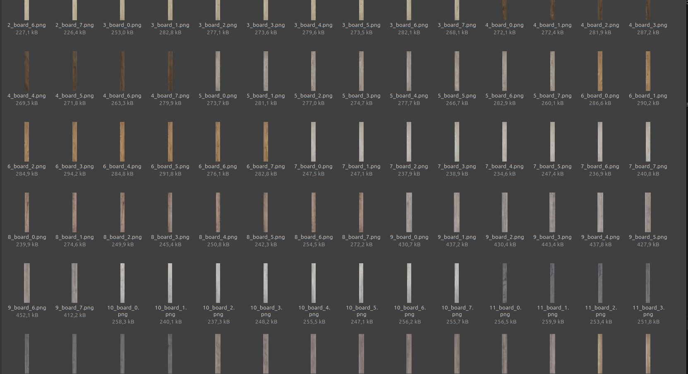
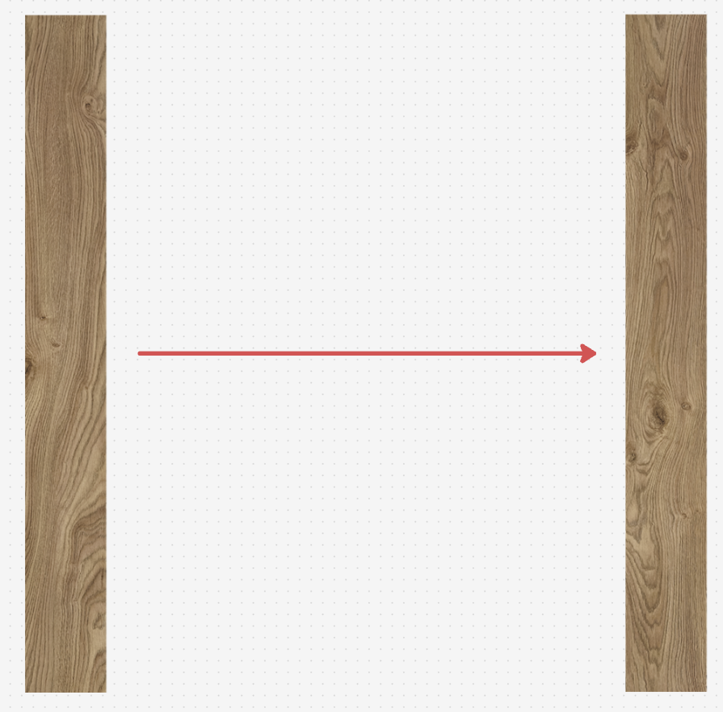
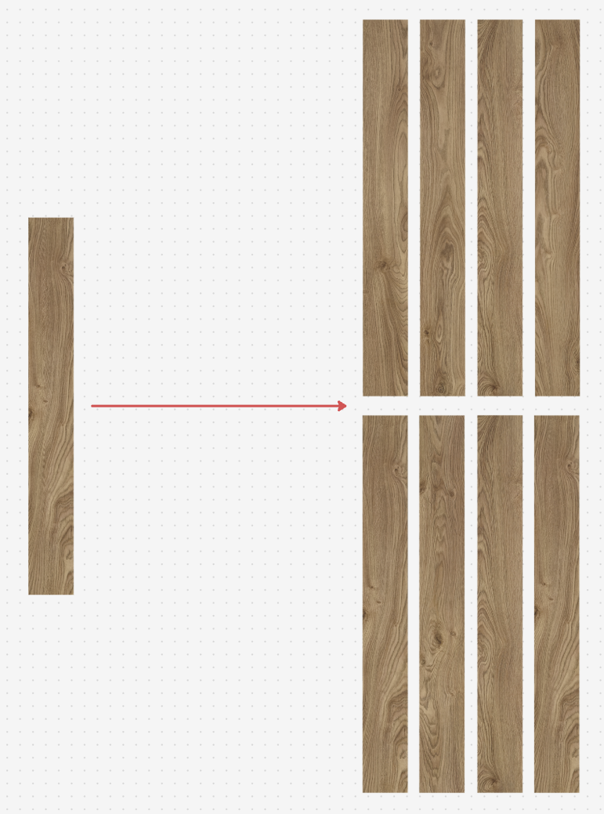
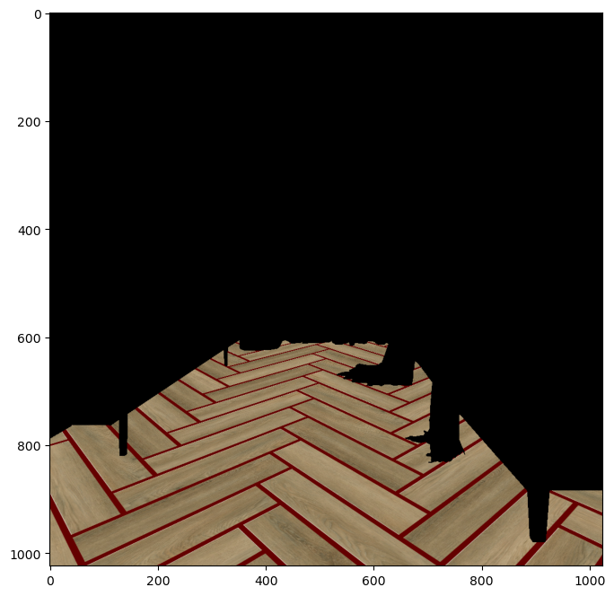
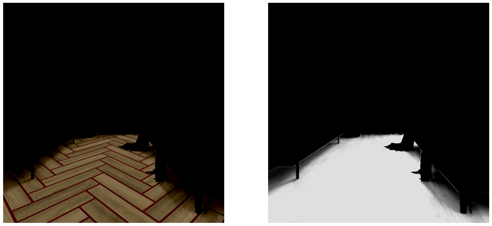
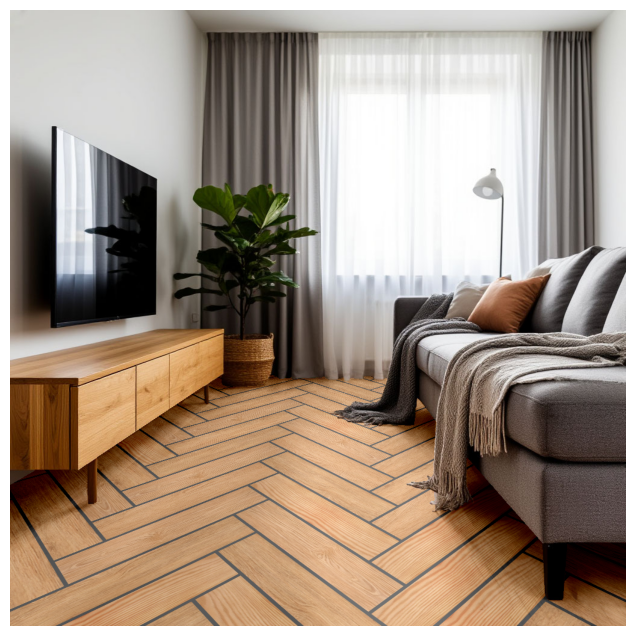

# Floor coverings

## Project Description

Our project is an AI-driven solution designed to generate realistic, visually coherent and customizable parquet floor patterns using Img2Img techniques. The goal of this project is to create customizable floor textures that seamlessly extend from an original sample, maintaining stylistic consistency while allowing for various customizations such as grain, grout color, chamfer, and mounting type.

The generated patterns could be used for both small-scale and large-scale flooring applications, with options for post-processing techniques like super-resolution to enhance the final output quality.

## [Dataset](https://drive.google.com/drive/u/2/folders/1ZQPvnsD83WCaFw7JWHrhILwrFOtJ1Xrh)

## Project Plan

1. **Dataset Preparation** - DONE:
   - Collected high-quality parquet images.
   - Preprocess the images to divide it into desks.
   - Create all possible pairs within each tile group to support training, and uploaded the [complete dataset](https://huggingface.co/datasets/Zaurall/floor_coverings_1) to Hugging Face.
   
   

2. **Model Selection and Fine-Tuning** - DONE:
   - We experimented with different VAE (taking another distribution in the latent space) and SDXL. Their pretrained versions showed not ideal situtaion;
   - Both of them has their pros and cons. VAE is fast but encoder tries to reproduce original image, so we need to retrain the VAE to generate different patterns. GAN is slow and can generate different pattern, but it nead finetuning;
   - The best solution was StableDiffusion. SD 1.5 was able to generate images that were visually indistinguishable from real ones by the human eye.

3. **Pattern Generation Method** - DONE:
   - **Method 1**: Generate and assemble similar parquet patterns.
   
   

   - **Method 2**: Generate several parquet simultaneously.
   
   

   - We planned to implement first method with VAE because of its inference speed, but ran into problem - fine-tuned VAE did not succeed with different pattern generation;
   - Second method was used with GAN, because it was more time consuming. But we ran into another problem - GAN was able to generate new color chemes from original one, but it was not able to generate textures at all.

4. **Model Fine-Tuning** - DONE:
   - The best model was StableDiffusion 1.5. Fine-tuning of SD gave us the variety of different texture patterns with good inference speed. It offered a good balance between visual fidelity and generation control (we controlled different categories: woods, stones with the prompt). Additionally, the output resolution was already high (512 on the longer side), eliminating the need for an upscaling step that was necessary for GAN and VAE.

5. **Customization**: - DONE:
   - The generated boards exhibited realistic textures, patterns, and color palettes. The model effectively aligned the output with the given prompt, though some issues with generalization were observed. For example, if the prompt specified ”wood” but the base image showed ”stone,” the model might generate a wooden pattern with stone coloring;
   - The final generated boards are generated with a prompt, so it is customizeable according to user preferences.

5. **Post-Processing**: - DONE:
   - We made a pipeline that connected boards according to some pattern, then bisually transformed it and applied several masks - interior, shadow, and light:

   

   

   

