# Floor coverings

## Project Description

Our project is an AI-driven solution designed to generate realistic, visually coherent and customizable parquet floor patterns using Img2Img techniques. The goal of this project is to create customizable floor textures that seamlessly extend from an original sample, maintaining stylistic consistency while allowing for various customizations such as grout (glue between the boards) settings and mounting type.

  

## Business Problem

  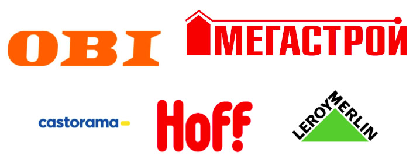

Building material companies invest significant resources in producing professional visual content (e.g., interior photos, product images, layout meshes) to showcase their flooring products. 

  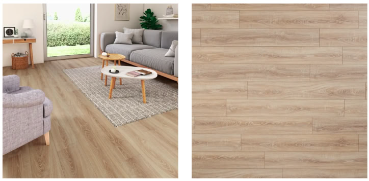

Traditional methods are both expensive and prone to human error—especially when suppliers cannot provide the full range of photo types required. 

  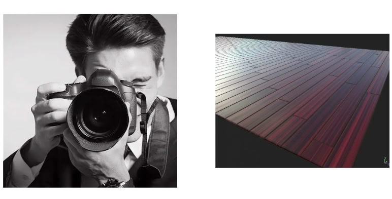

Our AI-powered solution automates the generation of realistic and customizable tile patterns, enabling:

- Faster content production.
- Cost-effective design customization.
- High-fidelity results that meet marketing standards.

## Pipeline

### 1. Generating similar tiles:

We explored different models to create duplicates of initial parquet board including Variational Autoencoders (VAEs), Generative Adversarial Networks (GANs), and Stable Diffusion (SD 1.5).

  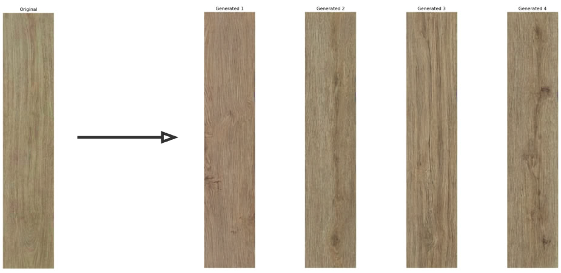

**VAE** – was simply smoothing the image without generating new pattern  
**GAN** – was changing the color but not generating pattern  
**SD** – only it produced results that are visually indistinguishable from real ones

### 2. Tile Connector:

Generated tile variations are arranged into complete layouts using three connectors:

- Shifted: For a staggered, brick-like layout.
- Chaotic: For naturally irregular arrangements.
- Herringbone: For an artistic diagonal pattern.

Supports customizable grout (width and color) settings.

  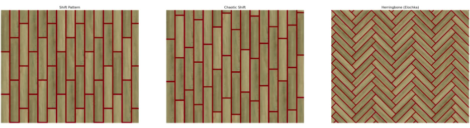

### 3. Interior Photo Generation:

To put generated layouts to interior image we need a template, it's mask of the floor, lights and shadows.

  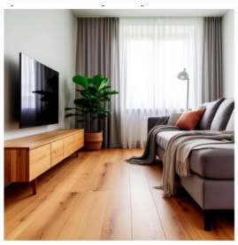

After that we change the perspective of the layout and intersect it with mask.

  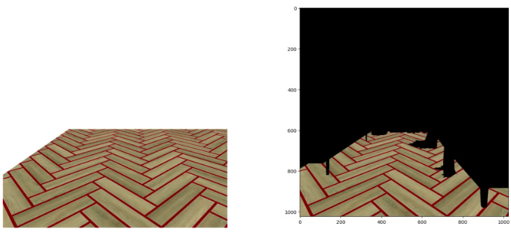

Adding shadows

  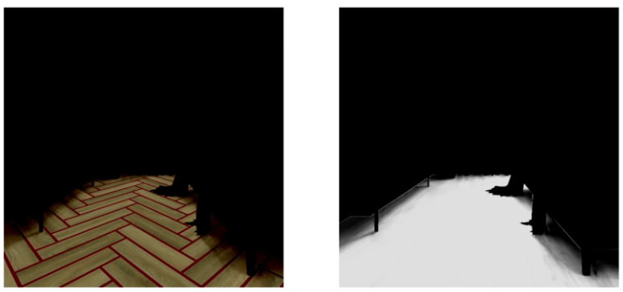

Adding lights

  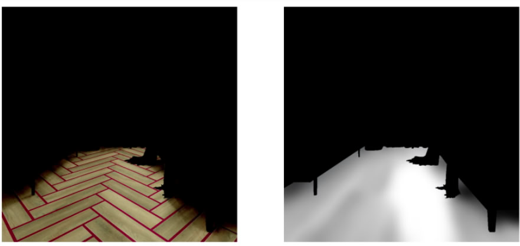

Result

  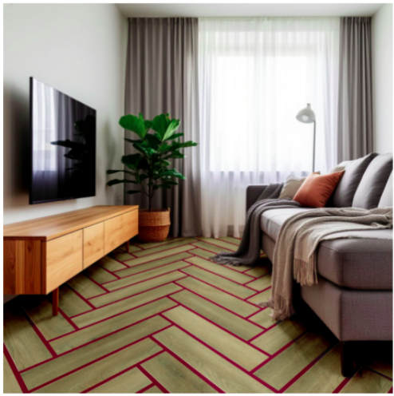

## Experiments and Evaluation

### Evaluation

A core challenge in the computer vision domain is the lack of clear and consistent evaluation metrics. In our case, the objective is to generate tiles with different patterns (wood, stone), while preserving the original color, tone, and structure.

One commonly used metric is LPIPS, which evaluates perceptual similarity by comparing deep features between two images. However, LPIPS has a critical limitation: it often assigns high similarity scores even when noticeable changes occur, as long as the overall deep feature distance remains small.

Because of this, we opted for human evaluation. We visually assessed model-generated images to determine whether they introduced new patterns while retaining desired attributes.

Additionally, it is possible to train a model based on human decisions to detect pattern changes, this would require significant time and resources. Therefore, we decided it’s not necessary for our current needs.

### Experiments

The experiments focused on comparing three primary models: Variational Autoencoders (VAEs), Generative Adversarial Networks (GANs), and Stable Diffusion (SD 1.5).

#### Variational Autoencoder (VAE) Approaches

We first used a VAE to learn a compact latent representation of parquet patterns. We experimented with two strategies: sampling from different regions of the latent space and fine-tuning a pretrained VAE using perceptual loss.

- In theory, sampling from different latent distributions should introduce subtle variations—preserving overall structure while adding new details or color shifts. In practice, however, it mostly resulted in blurred versions of the original image with minimal change.

  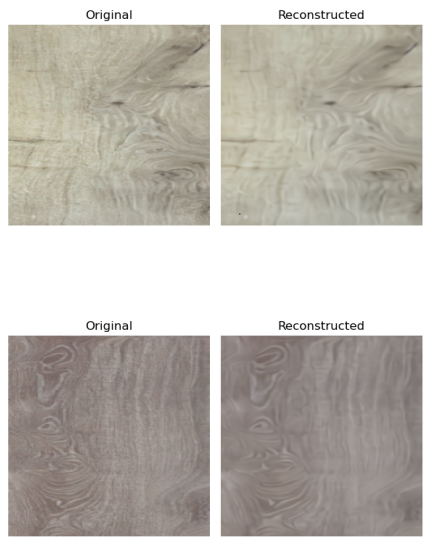

- To improve perceptual quality, we applied perceptual loss using a pretrained VGG-16 network, fine-tuning a pretrained VAE model (KBlueLeaf/EQ-SDXLVAE). This loss function compares high-level features rather than raw pixel values (similar to LPIPS). Nonetheless, the outputs remained very similar to the input images.

  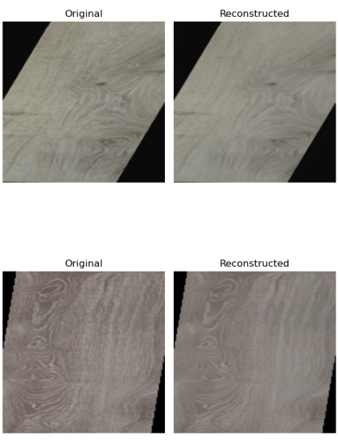

Although these methods produced texture-like outputs, they lacked sharpness and diversity. Moreover, the output resolution was limited to 256×256, and the images mainly resembled blurred copies of the original inputs.

#### Generative Adversarial Network (GAN)

We next trained a GAN from scratch.

After 100 epochs, the model managed to learn the overall color distribution of parquet boards but failed to capture texture and structure. This could be attributed to mode collapse or insufficient training. Regardless, the results were inferior even to the basic VAE, so we moved on to a more advanced method.

  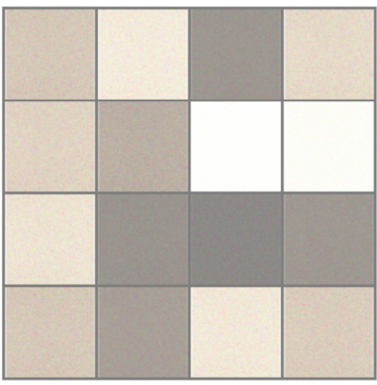

#### Stable Diffusion (SD)

Finally, we fine-tuned Stable Diffusion 1.5 (runwayml/stablediffusion-v1-5) in an Img2Img configuration. This model was capable of extending floor patterns in a stylistically consistent way, producing realistic and diverse textures. It offered a good balance between visual fidelity and generation control (we controlled different categories: woods, stones with the prompt). Additionally, the output resolution was already high (512 on the longer side), eliminating the need for an upscaling step.

  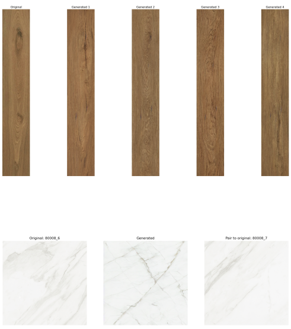

## [Dataset](https://drive.google.com/drive/u/2/folders/1ZQPvnsD83WCaFw7JWHrhILwrFOtJ1Xrh)

We collected a dataset of tile images grouped in two formats: multiple tiles within a single image, and individual tiles provided as separate images. For the group images, we automatically split them into individual tile samples.

Each tile was processed: rotated vertically, resized, and upscaled.

Finally, we created all possible pairs within each tile group to support training, and uploaded the complete dataset to Hugging Face [Hugging Face](https://huggingface.co/datasets/Zaurall/floor_coverings_1).

# Results

  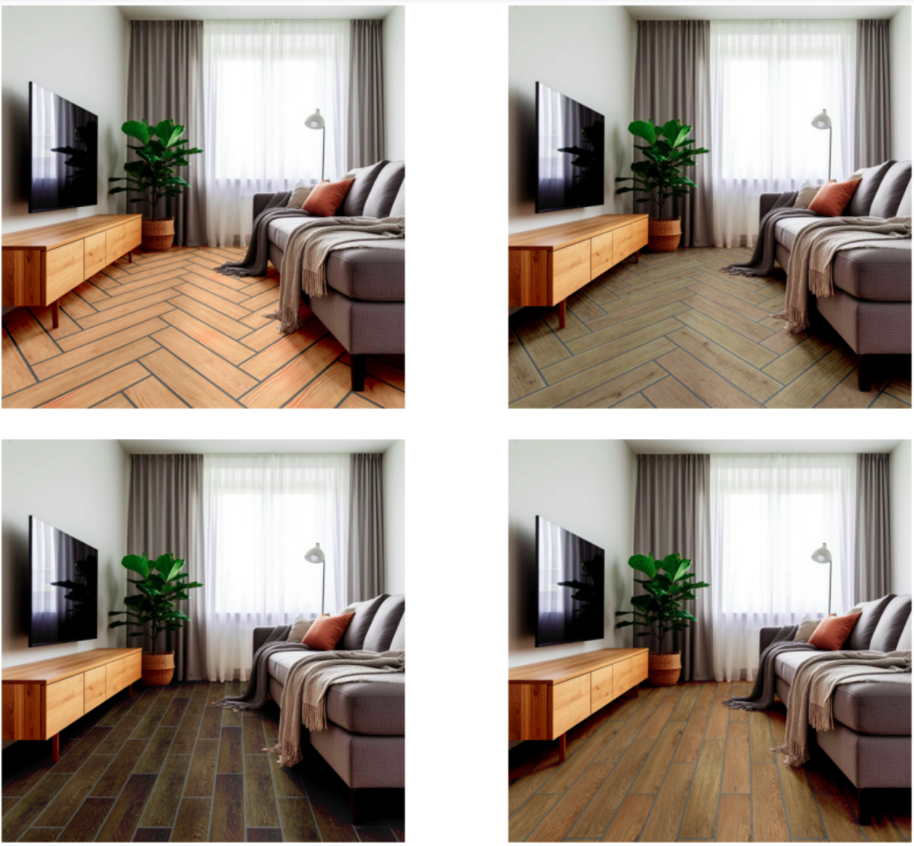

